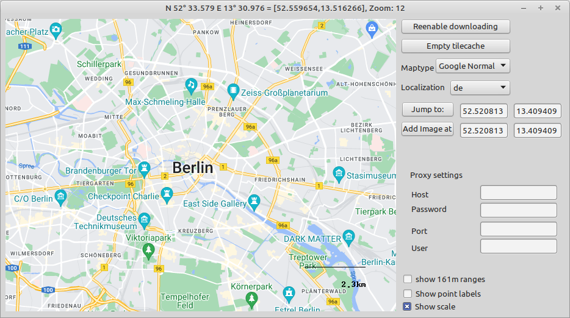

# Mapviewer

This Demo application shows the usage of umapviewer.pas

As the umapviewer.pas initially was developed for [CCM](https://github.com/PascalCorpsman/CCM) there are a lot of features which make more or less only sense in this application (like the show 161m range feature)

## Features
- Support only google maps
- download and cache maptiles (for offline use)
- general support for localizations (need cache empty)
- jump to given coordinate
- included koordinate conversion between DEG and DEC
- Custom images at koord
