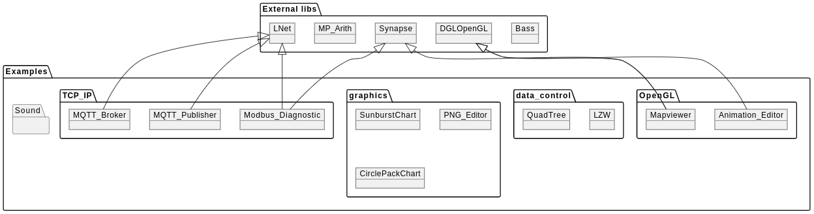

# Introduction
This Repository collects a lot of usefull and mostly not trivial examples that can be used to start a own application.

## ! Attention !
If you get a "could not find" error when compiling the examples, this could be caused by the directory name change during translation and uploading into this repository. Add the missing file's by hand with the project inspector from the IDE.

## Overview

# Details

## OpenGL

Collection of classes and examples that are mainly related to OpenGL implementations

| Example | Description |
| --- | --- |
| Mapviewer | Include Google maps into your own application using OpenGL as render engine. Chaches maptiles on local drive for offline use. |

## data_control

Collection of classes and examples corresponding to data processing, math and corresponding stuff

## graphics

Collection of classes and examples corresponding to graphic / image processing

## Dependencies
Some examples may have dependencies to external libraries here is the collection where to find and download this libraries (as they are not part of this repository):

| libname | Description | Link |
|---|---|---|
| Synapse | Synapse TCP/IP and serial library | http://www.ararat.cz/synapse/doku.php/download |
| DGLOpenGL | OpenGL Header translation | https://github.com/saschawillems/dglopengl |
| MP-Arith | Mathlibrary for big numbers | https://web.archive.org/web/20190628091417/http://www.wolfgang-ehrhardt.de/index.html |
| Lnet | Lightweight Networking Library | https://github.com/almindor/lnet |

