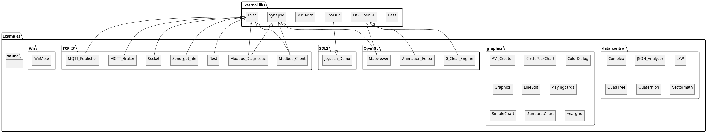

# Introduction
This Repository collects a lot of usefull and mostly not trivial examples that can be used to start a own application.

## ! Attention !
If you get a "could not find" error when compiling the examples, this could be caused by the directory name change during translation and uploading into this repository. Add the missing file's by hand with the project inspector from the IDE.

## Overview
Shows the dependencies of the demos to the external libraries (see [dependencies](#Dependencies) how to get to the missing code).

# Details

## OpenGL
Collection of classes and examples that are mainly related to OpenGL implementations

| Example | Description |
| --- | --- |
| [Clear_Engine](OpenGL/0_Clear_Engine) | Basic Example that shows the minimum needed to create a OpenGL application |
| [Animation_Editor](OpenGL/Animation_Editor) | Editor to create and edit .ani files |
| [Mapviewer](OpenGL/Mapviewer) | Include Google maps into your own application using OpenGL as render engine. Chaches maptiles on local drive for offline use. |
| umapviewer.pas | LCL-Component to make google mapviewer in OpenGL possible |
| uopengl_animation.pas | Class to load and render .ani files (see Animation_Editor) |
| uopengl_ascii_font.pas | DOS-stile ASCII-Font to easily show texts in OpenGL windows |
| uopengl_camera.pas | Helper class to correct set OpenGL modelview matrix in a scene |
| uopengl_font_common.pas | Anchestorclass for TOpenGL_TrueType_Font and TOpenGL_ASCII_Font |
| uopengl_graphikengine.pas | Class to load and render graphics into the OpenGL window |
| uopengl_partikelengine.pas | Class to render thousands of particle graphics into the OpenGL window |
| uopengl_primitives.pas | Collection of higher level primitive objects (sphere, cone, cube..) |
| uopengl_spriteengine.pas | Class to render multiple imageparts within defined delta times |
| uopengl_truetype_font.pas | Class to render truetype fonts to OpenGL windows |
| uopengl_widgetset.pas | TButton, TScrollbar, TListbox.. for a OpenGL Renderingcontext |

## SDL2
Collection of classes and examples corresponding to the usement of SDL2
| Example | Description |
| --- | --- |
| [Joystick_Demo](SDL2/Joystick_Demo) | Demo for usdl_joystick.pas and usdl_gamecontroller.pas |
| usdl_joystick.pas | class to easy access to joysticks |
| usdl_gamecontroller.pas | class to easy access to gamecontrollers |

## TCP_IP
Collection of classes and examples that are mainly related to Serial and Network communications

| Example | Description |
| --- | --- |
| [MQTT_Broker](TCP_IP/MQTT_Broker) | Shows a implementation of uMQTTbroker.pas (only publish / subscibe no evaluations) |
| [MQTT_Publisher](TCP_IP/MQTT_Publisher) | Demo that can send MQTT Publish messages to a given IP-Address (no security login) |
| [Rest](TCP_IP/Rest) | Demo to show capabilities of urest.pas |
| [Modbus_Client](TCP_IP/Modbus_Client) | Application to emulate a MODBUS-Slave device |
| [Modbus_Diagnostic](TCP_IP/Modbus_Diagnostic) | Shows a implementation for the MODBUS RTU, MODBUS-TCP and MODBUS-TCP RTU version, use to detect address offset and encoding of the MODBUS SLAVE |
| [Send_get_file](TCP_IP/Send_get_file) | Demo to transmit a file between server and client with a TCP-IP connection using L-Net |
| [Socket_lNet](TCP_IP/Socket_lNet) | Demo application that shows how to establish a TCP-IP connection with L-Net |
| uMQTTbroker.pas | a simpliest MQTT broker, only capable of receiving publishing clients (need L-Net) |
| uchunkmanager.pas | Server / Client component to send packages of data through a TCP-IP connection (need L-Net) |
| uhtml.pas | HTML-DOM parser |
| uip.pas | Some helper routines to work and get IP's |
| umultipartformdatastream.pas | Class to create HTML Multipartforms as a stream |
| urest.pas | implementation of a rest server / client |
| usynapsecomponents.pas | Class that tries to mimik lNet interface but uses Synapse |
| usynapsedownloader.pas | Class to use httpSend (see Synapse) to download files with progress update events |
| utcp.pas | abstract wrapper for TLTcp (need L-net) |
| uupdate.pas | class to easy automate update the application when developed |

## Wii

Collection of classes and examples corresponding to use the Wiimote controller

! Attention !
the Wii classes and components do only support Linux.

Preconditions: 
- "sudo apt install xwiimote"
- "sudo apt install libxwiimote-dev"

| Example | Description |
| --- | --- |
| [WiiMote](Wii/WiiMote) | Demo application for uxwiimote.pas |
| ulibxwiimote.pas | basic header translation from c to fpc |
| uxwiimote.pas | Lazarus wrapper for ulibxwiimote.pas |

## data_control
Collection of classes and examples corresponding to data processing, math and corresponding stuff

| Example | Description |
| --- | --- |
| [BMPQuadTree](data_control/BMPQuadTree) | demo application for ubmpquadtree.pas |
| [Complex](data_control/Complex) | demo for ucomplex.pas |
| [delforlazarus](data_control/delforlazarus) | designtime component for codeformating inside the IDE |
| [JSON_Analyzer](data_control/JSON_Analyzer) | demo application for uJSON.pas |
| [lazcomment](data_control/lazcomment) | designtime component to comment / uncomment code inside the IDE |
| [LZW](data_control/LZW) | demo application for uLZW.pas (Lempel-Ziv-Welch algorithm) |
| [Quadtree](data_control/QuadTree) | unit tests for uquadtree.pas |
| [Quaternion](data_control/Quaternion) | unit tests for uquaternion.pas |
| [Vectormath](data_control/Vectormath) | unit tests for uvectormath.pas |
| uJSON.pas | JSON-Loader / writer class |
| uLZW.pas | Implementation of Lempel-Ziv-Welch algorithm with two different dictionaries |
| ubitstream.pas | Stream to store and load bitwise data (typically only needed in compression algorithms) |
| ubmpquadtree.pas | own implementation for a quadtree compression for greyscale .bmp images |
| ucomplex.pas | Basic component to do calculations with complex numbers |
| ucrc.pas | Generic crc calculation class |
| udomxml.pas | generic xml parser |
| ueventer.pas| class toc reate events for components that are not derived from LCL-Components |
| ufifo.pas | generic first in first out class |
| ufilo.pas | generic first in last out class |
| ugenmathcalc.pas | generic parser / solver for binary and unary operands (typically used to parse mathematical formulas) |
| uimodbus.pas | Modbus server class for Modbus TCP or Modbus RTU |
| uinterpreter.pas | Pascal Interpreter |
| uiwrapper.pas | data source wrapper for uimodbus.pas (Lnet or Synapse) | 
| ulogger.pas | general data logging framework to be included into own application | 
| umathsolver.pas | String solver for mathematical expressions like "1+2 shl 3" (need MP-Arith) | 
| uuncommenter.pas | class to rulebased remove text from text (e.g. when parsing source code) | 
| uneuralnetwork.pas | generic neural network implementation (not performant but simple) |
| uquadtree.pas | generic quadtree class |
| uquaternion.pas | library to do math with quaternions |
| usqlite_helper.pas | helper routines to access to SQLLite3 databases (needs SQLDBLaz package)|
| utokenizer.pas | generic lexer class to lex strings into tokens |
| uuart.pas | thread based wrapper for synaser.pas (see Synapse) |
| uuart_deprecated.pas | wrapper for synaser.pas (see Synapse) |
| uvectormath.pas | Math library for multidimensional things (e.g. OpenGL, Matrix ..) |

## graphics
Collection of classes and examples corresponding to graphic / image processing

| Example | Description |
| --- | --- |
| [AVI Creator](graphics/AVI_Creator) | Demo for ugwavi.pas |
| [CirclePackChart](graphics/CirclePackChart) | Demo application for ucirclepackchart.pas |
| [ColorDialog](graphics/ColorDialog) | Demo application for ucolordialog.pas |
| [ColorGrid](graphics/ColorGrid) | Demo application for ucolorgrid.pas |
| [Graphics](graphics/Graphics) | unit tests for ugraphics.pas |
| [LineEdit](graphics/LineEdit) | Demo application for ulineedit.pas |
| [Playingcards](graphics/Playingcards) | Demo application for uplayingcard.pas |
| [SimpleChart](graphics/SimpleChart) | Demo application for usimplechart.pas |
| [SunburstChart](graphics/SunburstChart) | Demo application for usunburstchart.pas |
| [Yeargrid](graphics/Yeargrid) | Demo application for uyeargrid.pas |
| ubmp_graphikengine.pas | Class to organise multiple graphiks within a application  |
| ucirclepackchart.pas | LCL-Component to display packed circles |
| ucolordialog.pas | A alternate TColordialog variant (oriented on KDE Colour Picker) |
| ucolorgrid.pas | A reimplementation of the tColorGrid component from Delphi5 |
| ugraphics.pas | collection of algorithms to manipulate images and do color calculations |
| ugwavi.pas | Class to create .avi files out of images and waves |
| ulineedit.pas | Class to edit a segmented transfer function |
| usimplechart.pas | a Tchart like component to create images with containing pointseries (especially designed to be part of a console application) |
| usunburstchart.pas | LCL-Component to display a sunburstchart diagram |
| uyeargrid.pas | LCL-Component to display a year on the formular |

## sound
Collection of classes and examples corresponding to sound / music processing
| Example | Description |
| --- | --- |
| uwave.pas | class to access .wav files |

## What do i need to compile the source of the examples

At least you need to have the [Lazarus IDE](https://www.lazarus-ide.org/index.php?page=downloads) installed. If the example needs more than that, see below for missing dependencies.

## Dependencies
Some examples may have dependencies to external libraries here is the collection where to find and download this libraries (as they are not part of this repository):

| libname | Description | Link |
|---|---|---|
| Bass | Audio library | https://www.un4seen.com/ |
| DGLOpenGL | OpenGL header translation | https://github.com/saschawillems/dglopengl |
| Lnet | Lightweight Networking library | https://github.com/almindor/lnet |
| MP-Arith | Math library for big numbers | https://web.archive.org/web/20190628091417/http://www.wolfgang-ehrhardt.de/index.html |
| SDL2 | Lib to access to pc hardware| https://github.com/PascalCorpsman/SDL2-for-Pascal |
| Synapse | Synapse TCP/IP and serial library | http://www.ararat.cz/synapse/doku.php/download   https://github.com/geby/synapse |

## License
All sourcecode files do have their own license header included at the top, for all other files in this repository see license.md for further informations.
