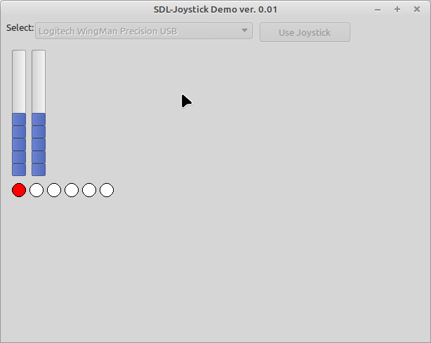

# SDL2 Joystick demo

This Demo shows how to get access to a joystick using sd2.pas.

Features:
- init SDL2 lib via static / dynamic linking

Dependencies:
- sdl2.pas (https://github.com/PascalCorpsman/SDL2-for-Pascal)
