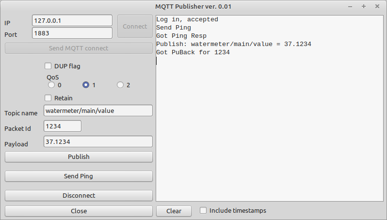

# MQTT publisher

This application simulates a simple MQTT device

Main feature is to connect unencrypted to a MQTT broker and send publish messages. This can either be usefull if you do not have the real MQTT device by hand or want to test your own MQTT broker implementation. Also implemented is the MQTT Ping packet.