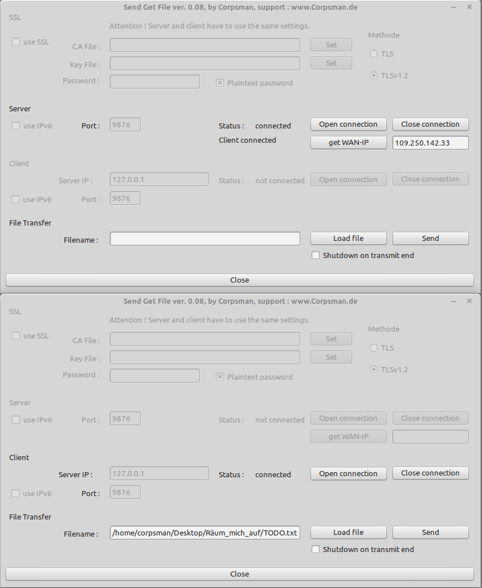

# Send_get_file

This demo shows how to use the L-Net TLTCPComponent component to transmit a file between 2 computers

Features:
- Listen to a port (Server)
- Connect to a IP and port (Client)
- send file from server to client / or send file from client to server
