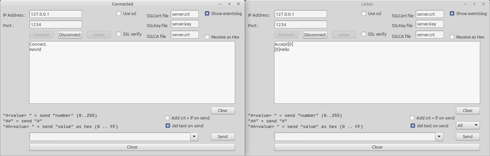

# Socket - Synapse

>
> !! Attention !! 
> This is a showcase demo with lots of bugs do not use in productive code !
>

This demo shows how to use the TSynapseComponent component.

Features:
- Listen to a port (Server)
- Connect to a IP and port (Client)
- Send as ASCII / Hex-Values
- Server supports as many clients as wanted

Known Bufs:
- When SSL is activated, the server needs to send 1 byte directly after accept, otherwise the client LCL thread stalls until the server send something.