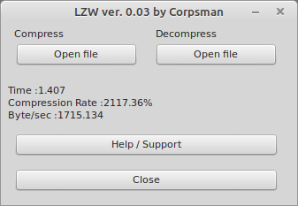

# Lempel-Ziv-Welch (LZW)

This Demo shows how the ulzw.pas can be used.

Features:
 - load and compress a single file with the LZW algorithm (including some statistics)
 - load and uncompress a compressed file
