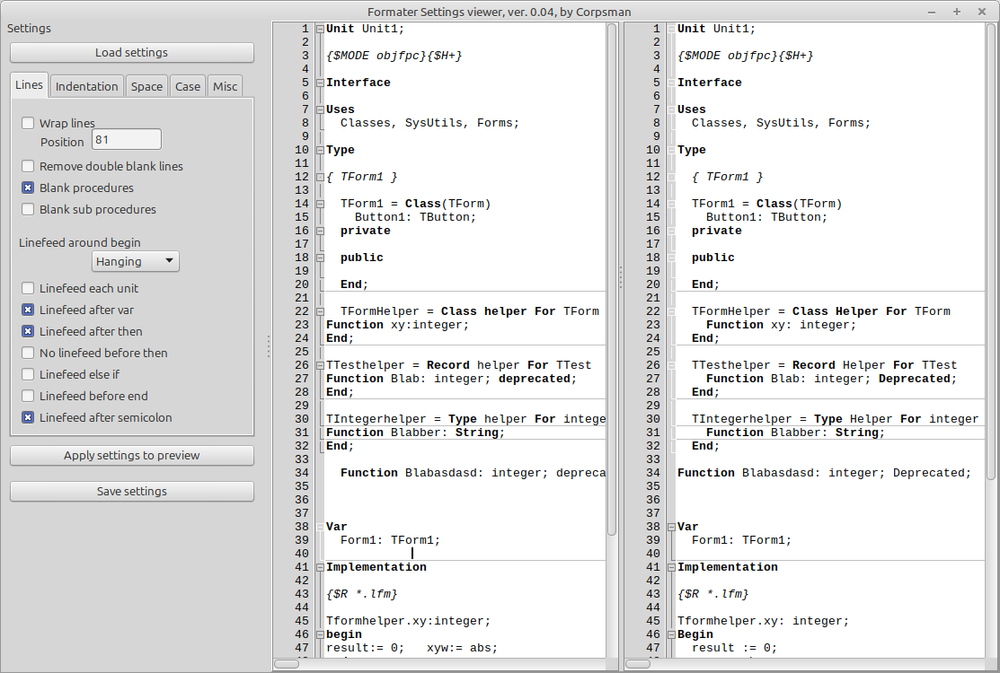

# Delforlazarus

This is a component to be used at designtime (only inside the IDE, during editing sourcecode). If you write your own FreePascal IDE (or a application that can show and format source code), than for shure you can also include the component into this application as well.

Its purpose is to "Format" the code by given rules (like uncrustify but for FreePascal).

Below is the preview of the settings editor, which is also shipped with this component.

Features:

- Prettyfy FreePascal Code

### Installation
Open the delforlazarus.lpk via the IDE and hit the install option (when requested to recompile the IDE's code, click YES).

After installation, you can "format" the current opened file, by pressing STRG + D.

Known Bug:
- if a line of code holds more then 1024 chars, the formater crashes.

! Attention !
The sourcecode of this component is not 100% written by me, the original inventor was:

> Egbert van Nes  
> http://www.dow.wau.nl/aew/DelForExp.html (NOTE: HAS CHANGED)  
> egbert.vannes@wur.nl 

Please read readme.txt for further informations.