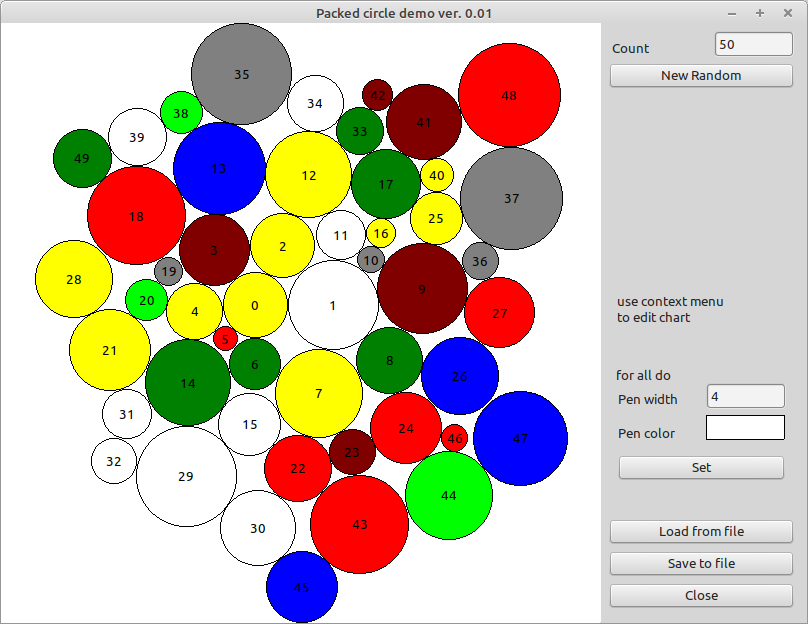

# Demo CirclePackChart

This application shows the usage of the ucirclepackchart.pas

Features:
* LCL-Component (renders into a given rectangle)
* Add circles with lots of attributes (color, caption, weight, userdata ...)
* Automatic "zoom" to best fit the resulting circle graph
* Support Iteratter pattern
* lots of callbacks (OnClick, OnMouse*, On*Paint..)
* Save- / Loadfrom*