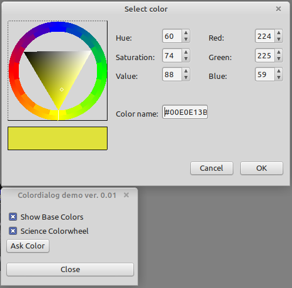

# Demo Colordialog 
This application shows the capabilities of the ucolordialog.pas

Feature:
- Scientific / intuitiv color selection
- Simplified and Gradient color selection
- RGB and HSV color selection
- Color preview in HTML-Style
