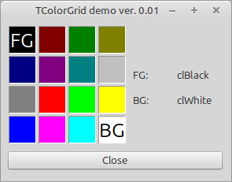

# Demo Colorgrid

This application shows the capabilities of the ucolorgrid.pas (a reimplementation of the Delphi 5 TColorGrid component)

Feature:
- Set / Get Foreground Color
- Set / Get Background Color
