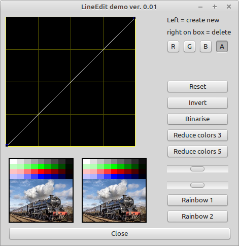

# LineEdit Demo

This Application show most capabilities of TLineEdit (here used to manipulate the colors of a picture).

Start the application and click on the buttons / or in the black area to learn its functions.

Features:
- add / insert points
- move selected points
- calculate transferfunction
