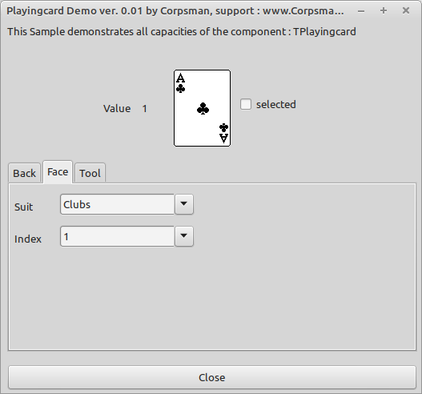

# Playingcards Demo

Years ago i wanted to create a card game, searched the web and found cards.pas (sorry source link is not available, but the name of the authors [Simon Fitch, Royal Road, Tombeau Bay, Mauritius]). I ported the component to Lazarus and made a little demo that can show its capabilities.

Features:
- full 52 carddeck (+ jokers)
- 10 back faces
- tool cards

If you want to use the component browse to [component](component) folder, you can either install the component into the IDE or use it without installation (like shown in the demo application).
