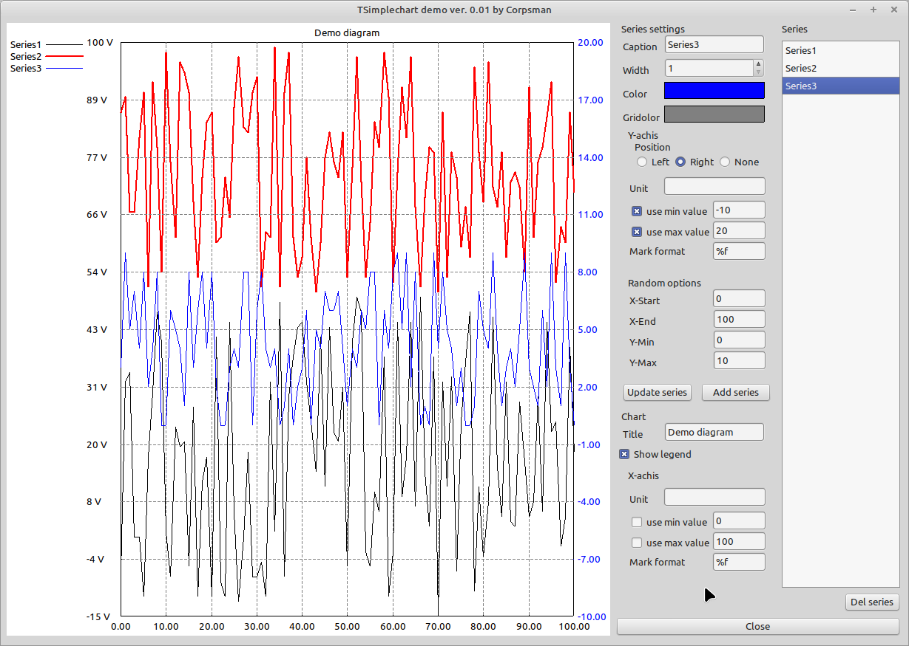

# Simplechart Demo

This Application show most capabilities of TSimplechart. 

! Keep in mind this is a "simple" version, designed for console application, not to meant to be a fully TAChart or fast and easy to use with the LCL !

Features:
- Multiple Series
- Multiple Y-Achsis (left or right)
- Fully Editable
- Designed for console applications (export as TPortableNetworkgraphik)
