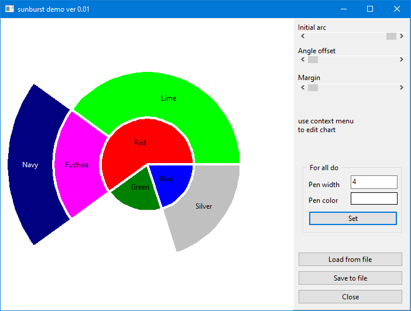

# Demo Sunburstchart

This demo application shows the capabilities of the TSunburstChart component.

General features:
 - Fully costumizable
 - based on TGraphicControl -> no other dependencies 
 - Properties:  
   * AngleOffset  
   * Color  
   * InitialArc  
   * LevelMargin  
   * PieRadius  
   * ShowHint
 - Eventhandlers:  
   * OnAfterSegmentPaint  
   * OnAfterPaint:  
   * OnBeforeSegmentPaint  
   * OnClick  
   * OnDeleteElementsUserData  
   * OnDblClick  
   * OnLoadUserData  
   * OnMouseUp  
   * OnMouseMove  
   * OnMouseDown  
   * OnSaveUserData  
   * OnShowHint  
   * OnResize
