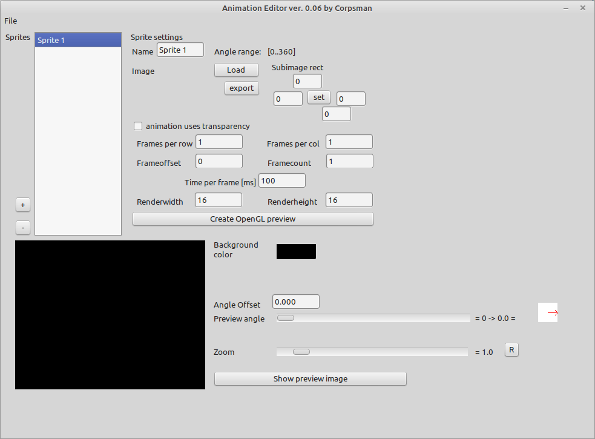
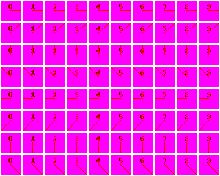
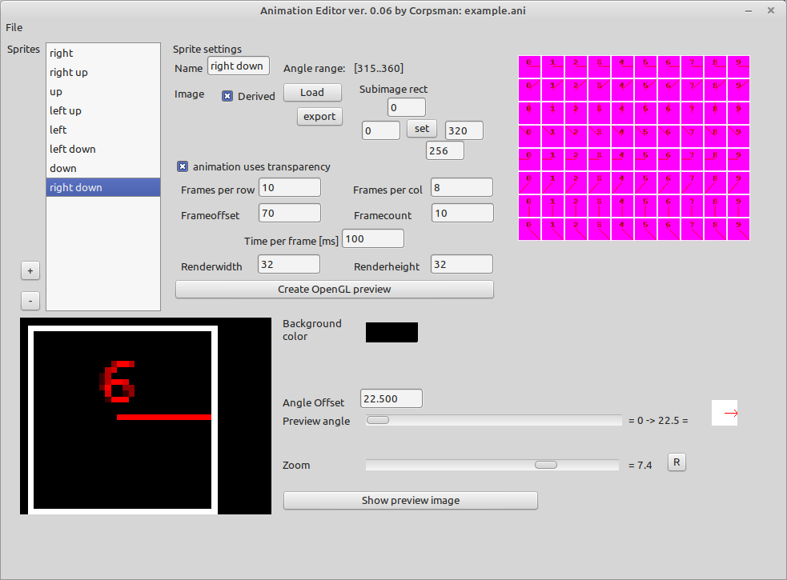

# Animation Editor

This application utilize uopengl_animation.pas to create .ani files which than can be loaded and used in OpenGL applications.

## What is a .ani file?
A .ani file is the file container for a TOpenGL_Animation class. 

## What features has TOpenGL_Animation 
TOpenGL_Animation provides a "angle" dependant rendering of images (2D-Animation). If you for example want to write a game with a player character that is able to move into multiple directions. You need to provide a animation for "walk left", "walk right","walk up" and "walk down" (and maybe a lot more). Each animation could consist of multiple images which are typically rendered each after each in a looping order. TOpenGL_Animation collects all these capabilities into on single class. 

All you need to do is:
* create a instance of TOpenGL_Animation 
* load the preconfigured .ani file 
* call the .render function. 

All Timings and image loopings are automatically handled by TOpenGL_Animation.

# How to use Animation Editor
1. First you need the image that you want to create a animation of. Typically the image consists of a sequence of images copied together in a row and column style (each sub image need to have the same width and height, but it is not necessary to have the same count of subimages). This could look like the following image.  
  
Animation Editor supports .bmp and .png files. If you use the "animation uses transparency" flag. This means in .bmp images the color RGB(255,0,255) will be rendered fully transparent. If you want "soft" transparency you need to use .png files and its alpha channel.
2. Next you need to specify the grid of subimages per image. In case of the example there are 10 "Frames per row" and 8 "Frames per col". The Renderwith and Renderheight are automatically calculated.
3. Adjust the "Time per frame" value as needed.
4. Create as many sprites needed to render the animation (a sprite is a angle range). In the example image above there are 8 angle ranges, so there are 8 sprites needed. In order to save disk space, use the "derived" flag that shows up starting at the second sprites. All already entered values are now automatically "derived" into the new ceated sprite.
5. Set the Frameoffset and Framecount values for each sprite. In the Example Framecount is 10 for all sprites. By clicking with the left mouse button onto the correct position of the preview image the calculated subimage index is filled into the Frameoffset field. Repeat this steps for all sprites (by clicking with the right mouse button the Framecount value will be filles out, but keep in mind that there is a offset of 1 as index is 0 based so you need to add 1 by hand).  Here is how this looks like for sprite 8:  
  
6. After setting up all needed parameters click the "Create OpenGL preview" button for each sprite (or save and reload the .ani file). In the preview area below you should now see your animation beeing rendered. By using the preview angle slider you should be able to see the "red" line rotating and the numbers beeing scrolled through.
7. When comparing the red arrow which is shown on the right side of the preview area, you see that there is one last step that needs to be done. Adjust the "Angle Offset" value from 0 to 22.5 (= (360 / 8) / 2) to get a better visual experience (to see why this is needed set the preview angle to 337 degree with and without the correction value and look what happens if you increase preview angle up to 359).
8. Store the .ani file and we are finished.
