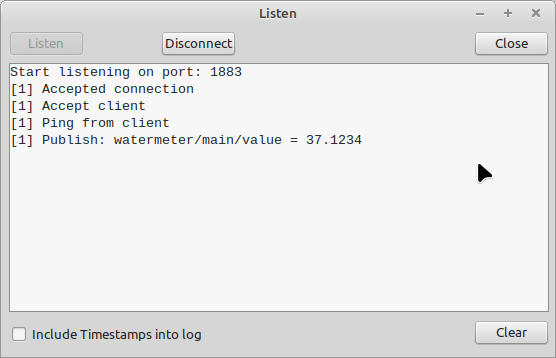

# MQTT broker

This application is a MQTT Broker (server on which the devices can connect to)

The goal of this application is not to provide a fully functional MQTT Broker, but instead give a easy access to a eventhandler that can be used to include MQTT devices into your own application.

# Features
- Connect (unencrypted)
- Subscribe
- Unsubscribe
- Publish
- Ping

Each of these packages will be received and correct (no warranties) responded. Some of the packages need answers during callback calls (see source code for that).

There is no routing, or other wildcard features implemented. This is all up to you.

# Use cases
- debugging of MQTT Connections
- endpoint for MQTT devices 

