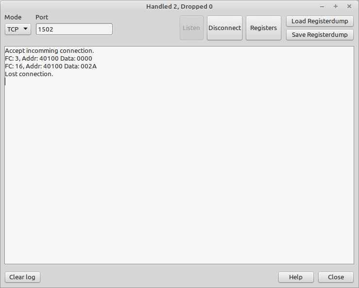

# Modbus Client

This application emulates a MODBUS Slave device with all possible registers.

Features:
- Modbus RTU
- Mudbus TCP (multiple Masters possible)
- 65536 Registers 
- Storing / loading of Register dump