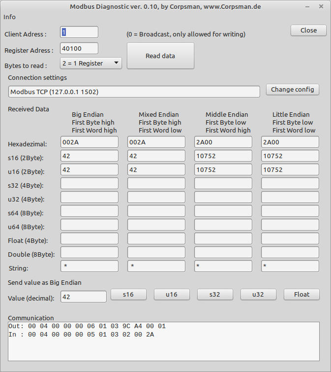

# Modbus Diagnostic

This application is made to test and debugg ModBus-RTU and ModBus-TCP connections.

## Features
- connect to client
- request arbiture register addresses (to figure out off by one register address mappings)
- show different encodings for easy identifications of client format
- rudimentary send abilities
- show raw traffic of communication (even if communication fails)