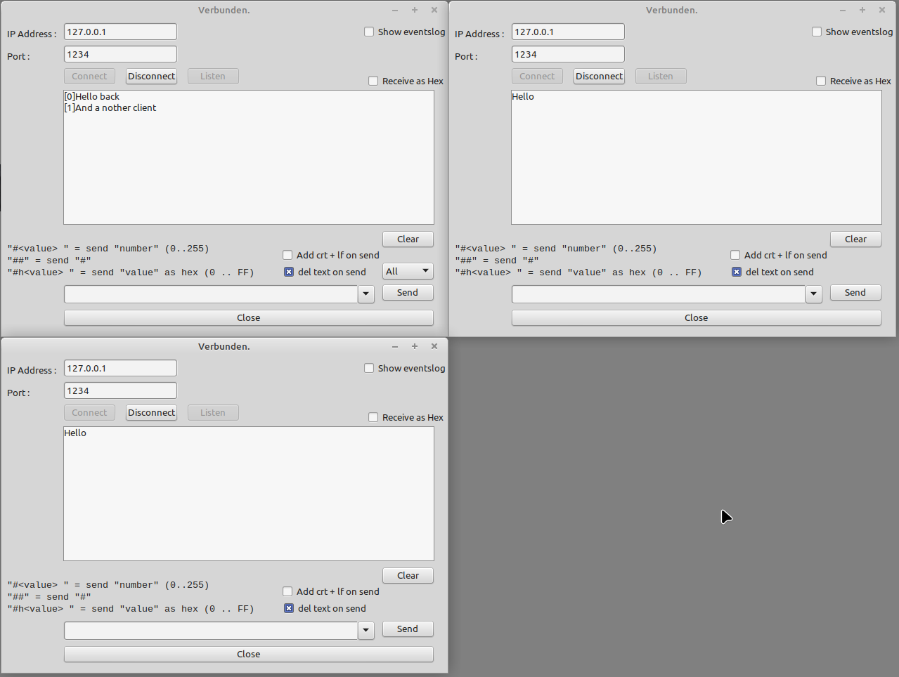

# Socket

This demo shows how to use the L-Net TLTCPComponent component.

Features:
- Listen to a port (Server)
- Connect to a IP and port (Client)
- Send as ASCII / Hex-Values
- Server supports as many clients as wanted